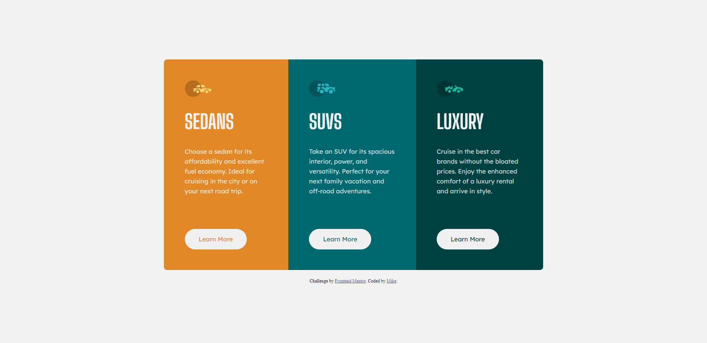
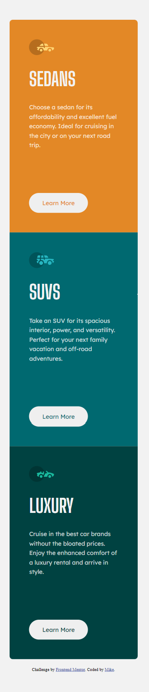

# Frontend Mentor - 3-column preview card component solution

This is a solution to the [3-column preview card component challenge on Frontend Mentor](https://www.frontendmentor.io/challenges/3column-preview-card-component-pH92eAR2-). Frontend Mentor challenges help you improve your coding skills by building realistic projects. 

## Table of contents

- [Overview](#overview)
  - [The challenge](#the-challenge)
  - [Screenshot](#screenshot)
  - [Links](#links)
- [My process](#my-process)
  - [Built with](#built-with)
  - [What I learned](#what-i-learned)
  - [Continued development](#continued-development)
  - [Useful resources](#useful-resources)
- [Author](#author)
- [Acknowledgments](#acknowledgments)

**Note: Delete this note and update the table of contents based on what sections you keep.**

## Overview
In this project, I designed and implemented a responsive 3 column preview card component using HTML and CSS. The challenge involved creating a layout that showcases different types of cars - sedans, SUVs, and luxury cars. The primary focus was on crafting an aesthetically pleasing and functional design that adapts seamlessly to various screen sizes.
### The challenge

Users should be able to:

- View the optimal layout depending on their device's screen size
- See hover states for interactive elements

### Screenshot





### Links

- Solution URL: [My solution URL](https://github.com/sanyomor-01/3-column-preview-card-component-main)
- Live Site URL: [live site URL](https://3-column-preview-card-component-main-san.vercel.app/)

## My process
Firstly I redesigned the component using figma since I'm not a pro member. This helped me get precise measurements of screens.
Then proceeded with page structure using the html.
Review every change on the browser and save the my progress on github.
I wrote the css style for the large screen and lastly the mobile screen review the changes every step of the way

### Built with

- Semantic HTML5 markup
- CSS custom properties
- Flexbox
- CSS Grid
- Mobile-first workflow

### What I learned

I leant how to use media queries and the specifications of the css properties.
This helped in implementing the mobile layout.

This is how you can add codes in the stylesheet file see below:
```css
@media screen (max-width: 26.44rem) {
  /* CSS code here*/
}
```

### Continued development

A preview page for earch car when a user clicks on the learn more button.


### Useful resources

- [](https://developer.mozilla.org/en-US/docs/Web/CSS/CSS_media_queries/Using_media_queries#syntax) - This helped me learn media queries reason. I really liked this pattern and will use it going forward.
- [Making Website responsive](https://www.youtube.com/watch?v=HHtMMS42cWs) - This is an amazing video which helped me finally understand the use of media queries, specifically the screen and max width property. I'd recommend it to anyone still learning this concept.


## Author

- Website - [Michael Sanyomor](https://www.linkedin.com/in/michael-sanyomor/)
- Frontend Mentor - [@sanyomor-01](https://www.frontendmentor.io/profile/sanyomor-01)
- Twitter - [@sanyo_mor](https://twitter.com/sanyo_mor)


## Acknowledgments

Thanks to me for not giving and making this project with Love. A pat on my back.


